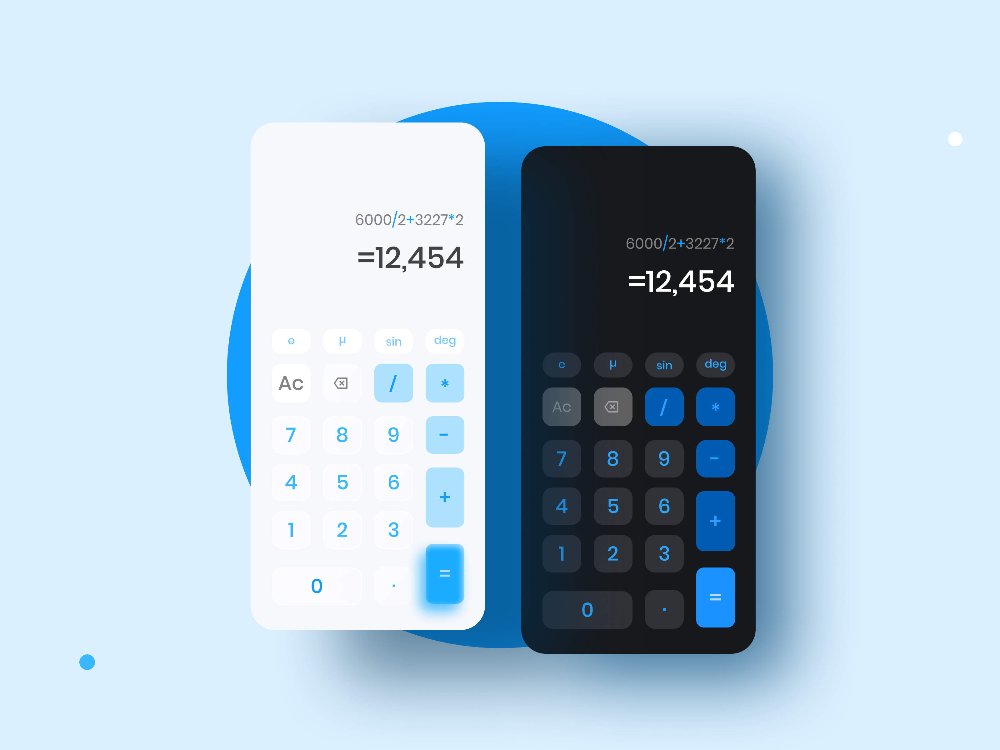

# CalcLite 🧮✨



Bem-vindo ao CalcLite, uma calculadora minimalista desenvolvida em React Native para tornar suas operações matemáticas simples e rápidas.

## Recursos 🚀

- Interface intuitiva e design limpo
- Operações matemáticas básicas
- Desenvolvido em React Native

## Tasks

- [x] Layout dos butões
- [x] Operação de adição e subtração
- [x] Operação de divisão e multiplicação
- [x] Validação de operadores
- [ ] Tema claro
- [ ] Seno, cosseno e tangente
- [ ] Outras operações

## Como usar 📲

1. Clone o repositório

   ```bash
   git clone https://github.com/mateushsx/calclite.git
   ```

2. Instale as dependências

   ```bash
   cd CalcLite
   npm install
   ```

3. Execute o aplicativo

   ```bash
   npx react-native run-android
   # ou
   npx react-native run-ios
   ```

## Contribuições 💡

Contribuições são bem-vindas! Sinta-se à vontade para reportar problemas ou enviar pull requests.

## Licença 📝

Este projeto está sob a Licença MIT.
